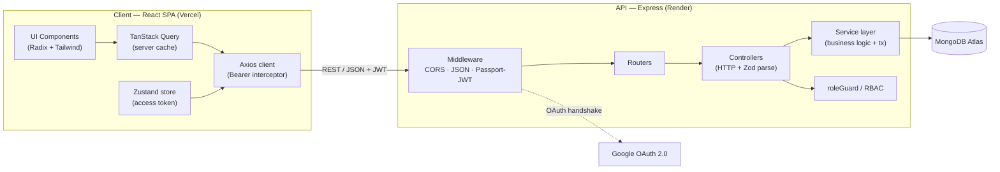
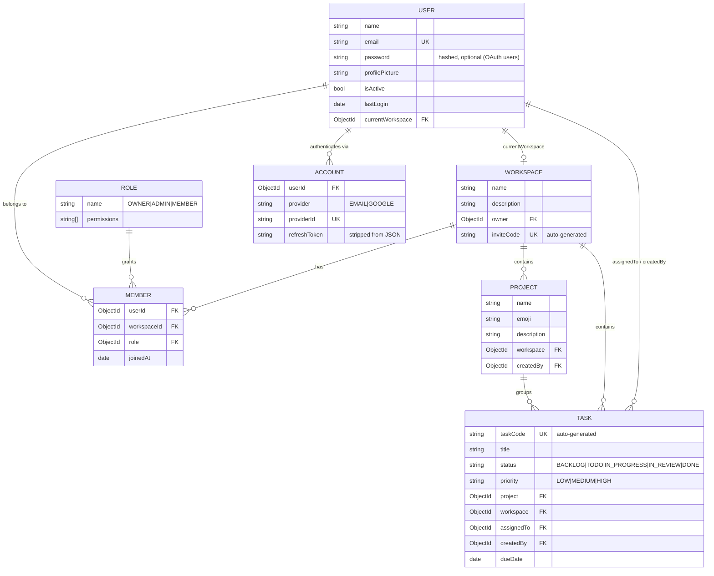
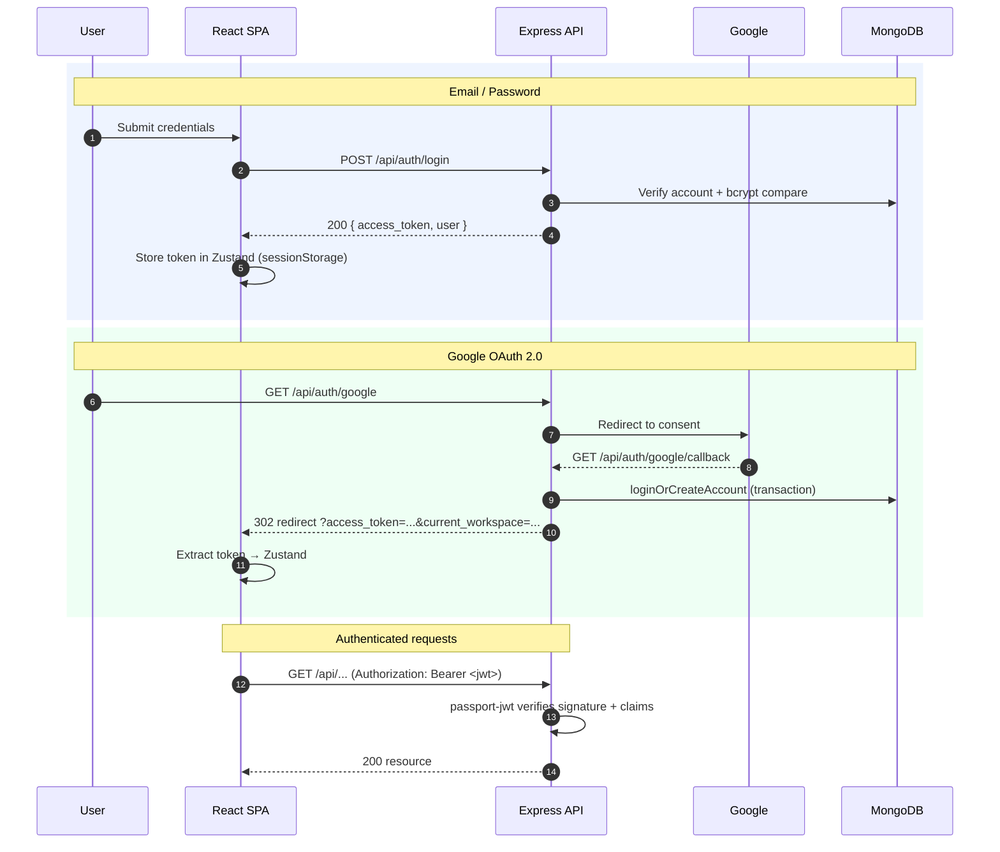
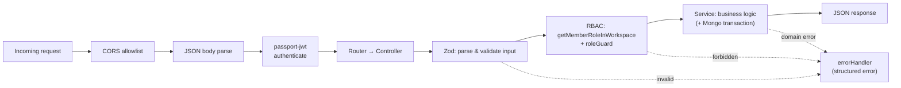

<div align="center">

# TaskFlow

### A multi-tenant, role-based project & task management platform

Workspaces, projects, tasks, team invitations, and granular RBAC — built as a production-oriented MERN monorepo with a type-safe, service-layered backend and a modern React data-driven frontend.

[](https://github.com/Sodiaro/project-management-saas/actions/workflows/ci.yml)
[](https://www.typescriptlang.org/)
[](https://nodejs.org/)
[](https://react.dev/)
[](https://expressjs.com/)
[](https://www.mongodb.com/atlas)
[](https://vitejs.dev/)

**[▶ Live Demo](https://taskflowsaas.vercel.app)** · **[API Docs (Swagger)](https://task-flow-3jk8.onrender.com/api/docs)** · **[API Health](https://task-flow-3jk8.onrender.com/health)**

Sign in with **`demo@taskflow.dev`** / **`demo1234`** — two seeded workspaces, 5 projects, 34 tasks and a team of 4 spanning every role.

> ⏳ The API runs on Render's free tier and sleeps after inactivity. **The first request can take ~30 seconds** while it wakes up; everything is instant after that.

</div>

---

## Table of Contents

- [Overview](#overview)
- [Key Features](#key-features)
- [Tech Stack](#tech-stack)
- [System Architecture](#system-architecture)
- [Monorepo Structure](#monorepo-structure)
- [Data Model](#data-model)
- [Authentication & Authorization](#authentication--authorization)
- [API Reference](#api-reference)
- [Request Lifecycle](#request-lifecycle)
- [Getting Started](#getting-started)
- [Environment Variables](#environment-variables)
- [Deployment](#deployment)
- [Continuous Integration](#continuous-integration)
- [Engineering Decisions & Trade-offs](#engineering-decisions--trade-offs)
- [Security Considerations](#security-considerations)
- [Production Readiness & Roadmap](#production-readiness--roadmap)
- [Screenshots](#screenshots)
- [License](#license)

---

## Overview

**TaskFlow** is a collaborative work-management application in the spirit of Jira, Asana, or Linear. It models the way real teams organize work: a **Workspace** is the tenant boundary, **Projects** group related work inside a workspace, and **Tasks** carry the day-to-day units of execution with status, priority, assignee, and due dates.

### The problem it solves

Teams need a shared, permissioned space to plan and track work — where the workspace owner controls membership, admins run projects, and members contribute tasks without being able to reshape the organization. Off-the-shelf tools solve this, but building it well requires getting several hard things right at once: **multi-tenancy isolation**, **role-based access control**, **transactional consistency** across related documents, and a **stateless authentication** model that scales horizontally.

TaskFlow is a focused, end-to-end implementation of exactly that core — small enough to read in an afternoon, but structured the way a production system is: a clean service layer, centralized error handling, schema-validated inputs, and a permission model enforced on every mutating path.

### Who it's for

- **Workspace owners** create and fully control a workspace and its billing-equivalent boundary.
- **Admins** manage projects, tasks, and membership within a workspace.
- **Members** contribute and edit tasks but cannot alter the workspace structure.

---

## Key Features

| Domain | Capabilities |
| --- | --- |
| **Authentication** | Email/password (local strategy) and Google OAuth 2.0, unified into a single stateless JWT session model |
| **Multi-tenancy** | Every user can belong to multiple workspaces; a `currentWorkspace` pointer tracks their active tenant |
| **Workspaces** | Create, update, delete (cascading), analytics, invite-code-based joining |
| **Projects** | Create, edit, delete, per-project analytics, emoji identity |
| **Tasks** | Full CRUD with status, priority, assignee, due date, and human-readable task codes |
| **RBAC** | Three roles (`OWNER`, `ADMIN`, `MEMBER`) with a 14-permission matrix enforced server-side |
| **Team collaboration** | Shareable invite links; role assignment and role changes |
| **Analytics** | Workspace- and project-level task rollups (total / overdue / completed) |
| **Data integrity** | Multi-document MongoDB transactions for registration, OAuth account linking, and cascading deletes |

---

## Tech Stack

### Backend (`/backend`)

| Concern | Technology |
| --- | --- |
| Runtime & language | Node.js, **TypeScript** (strict mode) |
| Web framework | **Express 4** |
| Database & ODM | **MongoDB** (Atlas) + **Mongoose 8** |
| Authentication | **Passport** — `passport-local`, `passport-google-oauth20`, `passport-jwt` |
| Tokens & hashing | `jsonwebtoken` (HS256), `bcryptjs` |
| Validation | **Zod** |
| Dev tooling | `ts-node-dev`, `tsc` |

### Frontend (`/client`)

| Concern | Technology |
| --- | --- |
| Framework & build | **React 18** + **Vite 6** + **TypeScript** |
| Server state | **TanStack Query** (React Query) |
| Client state | **Zustand** (with `persist` + `immer`) |
| Routing | **React Router 7** |
| URL/query state | **nuqs** |
| Forms & validation | **react-hook-form** + **Zod** |
| UI system | **Radix UI** primitives + **Tailwind CSS** (shadcn/ui pattern) |
| HTTP | **Axios** (interceptor-based auth) |

---

## System Architecture

TaskFlow is a decoupled two-tier application: a **stateless REST API** and a **single-page application** that communicate over HTTPS with a bearer-token contract. Because the API holds no session state, it scales horizontally behind a load balancer without sticky sessions.



### Design principles

- **Layered separation.** Routers wire HTTP paths; controllers own the HTTP concern (parse, validate, respond); services own business logic and persistence. Business rules never leak into the transport layer.
- **Stateless auth.** Authentication is a signed JWT presented via the `Authorization` header, so any API instance can serve any request.
- **Fail loud, fail structured.** A single Express error-handling middleware normalizes every failure — Zod validation, domain `AppError`s, malformed JSON, and unknown errors — into a consistent JSON envelope with a machine-readable `errorCode`.
- **Consistency over convenience.** Operations that touch multiple collections run inside MongoDB transactions so partial writes can't corrupt tenant state.

---

## Monorepo Structure

This repository hosts two independently deployable applications. There is no shared root package — each app has its own dependency tree, build, and lifecycle, which keeps the frontend and backend toolchains fully isolated.

```
project-management-saas/
├── backend/                  # Express + TypeScript REST API
│   └── src/
│       ├── config/           # app config, DB connection, Passport, HTTP status
│       ├── controllers/      # HTTP handlers (parse → call service → respond)
│       ├── services/         # business logic + persistence + transactions
│       ├── models/           # Mongoose schemas (User, Workspace, Project, Task, ...)
│       ├── routes/           # Express routers per resource
│       ├── middlewares/      # asyncHandler, errorHandler, isAuthenticated
│       ├── validation/       # Zod schemas
│       ├── enums/            # roles, permissions, task status/priority, error codes
│       ├── utils/            # jwt, bcrypt, roleGuard, RBAC map, uuid, AppError
│       ├── seeders/          # role/permission seeder
│       └── index.ts          # app bootstrap
│
├── client/                   # React + Vite SPA
│   └── src/
│       ├── components/        # UI primitives + feature components (workspace/task/…)
│       ├── page/              # route-level screens (auth, workspace, errors, invite)
│       ├── routes/            # route tables + protected/auth route guards
│       ├── hooks/             # data hooks (React Query) + UI hooks
│       ├── context/           # AuthProvider, QueryProvider
│       ├── store/             # Zustand store (auth/session)
│       ├── lib/               # axios client, API functions, helpers
│       └── types/             # shared API + error types
│
└── .github/workflows/ci.yml  # CI: build + lint for both apps
```

### Responsibilities at a glance

| Package | Responsibility | Deploys to |
| --- | --- | --- |
| `backend` | Stateless REST API, auth, RBAC, persistence, business rules | Render (Web Service) |
| `client` | SPA rendering, client routing, server-state caching, auth UX | Vercel (Static Site) |

---

## Data Model

Six core collections model the domain. A `Member` is the join entity that binds a `User` to a `Workspace` with a specific `Role`, which is what makes multi-tenancy and per-workspace permissions possible.



### Notable modeling decisions

- **Separate `Account` from `User`.** Credentials/identity providers live in their own collection keyed by `(provider, providerId)`. This cleanly supports a user signing in via both email and Google against one identity, and keeps provider secrets (e.g. `refreshToken`) out of the user document — and out of API responses via a `toJSON` transform.
- **`Role` as a document, not a string.** Roles are seeded records referenced by `Member`, so permissions can evolve centrally through [`RolePermissions`](backend/src/utils/role-permission.ts) without a data migration on every member.
- **Human-readable codes.** Tasks and workspace invites carry generated short codes (`taskCode`, `inviteCode`) for shareable, user-facing identifiers distinct from opaque ObjectIds.
- **Password hygiene at the schema layer.** The `User` model hashes passwords in a `pre('save')` hook and exposes an `omitPassword()` helper, so hashing and redaction are guaranteed regardless of the calling code path.

---

## Authentication & Authorization

### Two entry points, one session model

TaskFlow supports **email/password** and **Google OAuth 2.0**, but both converge on the same outcome: a signed **JWT** (HS256, `audience: "user"`, configurable expiry) that the client sends as a `Bearer` token. The API validates it with `passport-jwt` on every protected route — there is no server-side session store.

> The codebase includes `cookie-session` as a dependency, but the session middleware is intentionally disabled in favor of the stateless JWT model. This keeps the API horizontally scalable and avoids cross-site cookie complexity when the SPA and API live on different domains.



On the client, the [Axios request interceptor](client/src/lib/axios-client.ts) injects the token automatically, and the [`AuthProvider`](client/src/context/auth-provider.tsx) hydrates the current user and active workspace into React context.

### Role-Based Access Control (RBAC)

Authorization is enforced in the service/controller layer, not the router. A mutating handler first resolves the caller's role **in the target workspace** via `getMemberRoleInWorkspace`, then asserts the required permissions with [`roleGuard`](backend/src/utils/roleGuard.ts) against the central [`RolePermissions`](backend/src/utils/role-permission.ts) map. This makes permissions **workspace-scoped** — the same user can be an `OWNER` in one workspace and a `MEMBER` in another.

**Permission matrix** (source of truth: [`role-permission.ts`](backend/src/utils/role-permission.ts)):

| Permission | OWNER | ADMIN | MEMBER |
| --- | :---: | :---: | :---: |
| `CREATE_WORKSPACE` | ✅ | — | — |
| `EDIT_WORKSPACE` | ✅ | — | — |
| `DELETE_WORKSPACE` | ✅ | — | — |
| `MANAGE_WORKSPACE_SETTINGS` | ✅ | ✅ | — |
| `ADD_MEMBER` | ✅ | ✅ | — |
| `CHANGE_MEMBER_ROLE` | ✅ | — | — |
| `REMOVE_MEMBER` | ✅ | — | — |
| `CREATE_PROJECT` | ✅ | ✅ | — |
| `EDIT_PROJECT` | ✅ | ✅ | — |
| `DELETE_PROJECT` | ✅ | ✅ | — |
| `CREATE_TASK` | ✅ | ✅ | ✅ |
| `EDIT_TASK` | ✅ | ✅ | ✅ |
| `DELETE_TASK` | ✅ | ✅ | — |
| `VIEW_ONLY` | ✅ | ✅ | ✅ |

The frontend mirrors this map for UX (hiding controls a user can't use) via a `usePermissions` hook and `permission-guard` components — but the server remains the sole authority.

---

## API Reference

**Base path:** `/api` (configurable via `BASE_PATH`). All routes except `/auth/*` require a valid `Authorization: Bearer <jwt>` header.

> **Interactive docs:** every endpoint below is documented in OpenAPI 3.0 and served as Swagger UI at **[`/api/docs`](http://localhost:8000/api/docs)** — request/response schemas, permission requirements, error shapes, and a working *Try it out* console (click **Authorize** and paste a login `access_token`). The raw document is at [`/api/docs/openapi.json`](http://localhost:8000/api/docs/openapi.json) for client generation. Set `ENABLE_API_DOCS=false` to stop serving both. The source lives in [backend/src/docs/](backend/src/docs/) — update it alongside any route change.

### Auth — `/api/auth`

| Method | Path | Description | Auth |
| --- | --- | --- | :---: |
| `POST` | `/register` | Register with name, email, password | Public |
| `POST` | `/login` | Email/password login → `access_token` | Public |
| `POST` | `/logout` | Clear session | Public |
| `GET` | `/google` | Begin Google OAuth handshake | Public |
| `GET` | `/google/callback` | OAuth callback → redirect with token | Public |

### User — `/api/user`

| Method | Path | Description |
| --- | --- | --- |
| `GET` | `/current` | Current authenticated user |

### Workspace — `/api/workspace`

| Method | Path | Description |
| --- | --- | --- |
| `POST` | `/create/new` | Create a workspace (caller becomes OWNER) |
| `GET` | `/all` | Workspaces the caller is a member of |
| `GET` | `/:id` | Workspace by id (membership-checked) |
| `GET` | `/members/:id` | Workspace members + roles |
| `GET` | `/analytics/:id` | Task analytics for a workspace |
| `PUT` | `/update/:id` | Update workspace |
| `PUT` | `/change/member/role/:id` | Change a member's role |
| `DELETE` | `/delete/:id` | Delete workspace (cascading, transactional) |

### Member — `/api/member`

| Method | Path | Description |
| --- | --- | --- |
| `POST` | `/workspace/:inviteCode/join` | Join a workspace via invite code |

### Project — `/api/project`

| Method | Path | Description |
| --- | --- | --- |
| `POST` | `/workspace/:workspaceId/create` | Create a project |
| `GET` | `/workspace/:workspaceId/all` | List projects in a workspace |
| `GET` | `/:id/workspace/:workspaceId` | Project by id |
| `GET` | `/:id/workspace/:workspaceId/analytics` | Project analytics |
| `PUT` | `/:id/workspace/:workspaceId/update` | Update a project |
| `DELETE` | `/:id/workspace/:workspaceId/delete` | Delete a project |

### Task — `/api/task`

| Method | Path | Description |
| --- | --- | --- |
| `POST` | `/project/:projectId/workspace/:workspaceId/create` | Create a task |
| `GET` | `/workspace/:workspaceId/all` | List/filter tasks in a workspace |
| `GET` | `/:id/project/:projectId/workspace/:workspaceId` | Task by id |
| `PUT` | `/:id/project/:projectId/workspace/:workspaceId/update` | Update a task |
| `DELETE` | `/:id/workspace/:workspaceId/delete` | Delete a task |

### Error envelope

Domain and validation errors return a consistent shape:

```jsonc
// Validation error (Zod)
{ "message": "Validation failed", "errors": [{ "field": "email", "message": "Invalid email address" }], "errorCode": "VALIDATION_ERROR" }

// Domain error (AppError)
{ "message": "You are not a member of this workspace", "errorCode": "ACCESS_UNAUTHORIZED" }
```

---

## Request Lifecycle

Every request flows through the same predictable pipeline, which is what keeps handlers thin and error handling centralized:



The [`asyncHandler`](backend/src/middlewares/asyncHandler.middleware.ts) wrapper forwards any thrown/rejected error to the [`errorHandler`](backend/src/middlewares/errorHandler.middleware.ts), so controllers can `throw` freely without `try/catch` boilerplate.

---

## Getting Started

### Prerequisites

- **Node.js 20+** and npm
- A **MongoDB** database — MongoDB Atlas is recommended. Transactions require a **replica set** (Atlas provides this by default; a standalone local `mongod` does not).
- A **Google OAuth 2.0 Client** (Client ID + Secret) if you want Google sign-in.

### 1. Clone

```bash
git clone https://github.com/Sodiaro/project-management-saas.git
cd project-management-saas
```

### 2. Backend

```bash
cd backend
npm install
cp .env.example .env      # then fill in the values (see Environment Variables)
npm run seed              # seed the OWNER/ADMIN/MEMBER roles (run once)
npm run seed:demo         # optional — populate the demo tenant with sample data
npm run dev               # starts the API with hot reload
```

> **Seeding is required before first use.** Registration and workspace creation look up the seeded `OWNER` role; without it those flows will fail with "Owner role not found".

`npm run seed:demo` creates the `demo@taskflow.dev` account used by the live demo above — two workspaces, 5 projects, 34 tasks and 4 users covering `OWNER`, `ADMIN` and `MEMBER`. It is idempotent: re-running replaces only the demo tenant and leaves every other account untouched. Sign in as `maya@` (ADMIN) or `tobi@` (MEMBER) with the same password to see the RBAC rules change what the UI allows.

### 3. Frontend

```bash
cd client
npm install
cp .env.example .env      # set VITE_API_BASE_URL to your API URL + /api
npm run dev               # starts Vite dev server (default http://localhost:5173)
```

### Available scripts

**Backend**

| Script | Action |
| --- | --- |
| `npm run dev` | Start API with `ts-node-dev` (hot reload) |
| `npm run build` | Type-check & compile to `dist/` |
| `npm start` | Run the compiled server (`node dist/index.js`) |
| `npm run seed` | Seed roles & permissions |
| `npm run seed:demo` | Seed the demo tenant (users, workspaces, projects, tasks) |

**Frontend**

| Script | Action |
| --- | --- |
| `npm run dev` | Start Vite dev server |
| `npm run build` | Type-check & production build to `dist/` |
| `npm run lint` | Run ESLint |
| `npm run preview` | Preview the production build |

---

## Environment Variables

### Backend (`backend/.env`)

| Variable | Required | Description |
| --- | :---: | --- |
| `NODE_ENV` | — | `development` \| `production` |
| `PORT` | — | API port (Render injects this in production) |
| `BASE_PATH` | — | API base path (default `/api`) |
| `MONGO_URI` | ✅ | MongoDB connection string (replica set for transactions) |
| `JWT_SECRET` | ✅ | Secret for signing JWTs — use a long random value |
| `JWT_EXPIRES_IN` | — | Token lifetime (default `1d`) |
| `SESSION_SECRET` | ✅ | Reserved secret for the (currently disabled) session layer |
| `SESSION_EXPIRES_IN` | — | Reserved session lifetime |
| `GOOGLE_CLIENT_ID` | ✅¹ | Google OAuth client id |
| `GOOGLE_CLIENT_SECRET` | ✅¹ | Google OAuth client secret |
| `GOOGLE_CALLBACK_URL` | ✅¹ | e.g. `https://<api>/api/auth/google/callback` |
| `ENABLE_API_DOCS` | — | Serve Swagger UI at `/api/docs` (default `true`; set `false` to disable) |
| `FRONTEND_ORIGIN` | ✅ | Allowed CORS origin(s), comma-separated |
| `FRONTEND_GOOGLE_CALLBACK_URL` | ✅¹ | SPA route that receives the OAuth token |

¹ Required only if Google sign-in is enabled.

> Generate strong secrets with: `node -e "console.log(require('crypto').randomBytes(48).toString('hex'))"`

### Frontend (`client/.env`)

| Variable | Required | Description |
| --- | :---: | --- |
| `VITE_API_BASE_URL` | ✅ | API base URL **including** `/api`, e.g. `http://localhost:8000/api` |

> ⚠️ Only `VITE_`-prefixed variables are exposed to the browser bundle — **never** place secrets in `client/.env`; anything there ships to the client.

---

## Deployment

TaskFlow deploys as two services. Deploy the **backend first** so its public URL is available when configuring the frontend.

### Backend → Render (Web Service)

| Setting | Value |
| --- | --- |
| Root Directory | `backend` |
| Build Command | `npm install && npm run build` |
| Start Command | `npm start` |
| Environment | All backend variables above |

### Frontend → Vercel (Static Site)

| Setting | Value |
| --- | --- |
| Root Directory | `client` |
| Framework Preset | Vite |
| Build Command | `npm run build` |
| Output Directory | `dist` |
| Environment | `VITE_API_BASE_URL = https://<your-api>/api` |

### Cross-service wiring

1. Deploy backend → copy its URL.
2. Set the frontend's `VITE_API_BASE_URL` → deploy frontend → copy its URL.
3. Update the backend's `FRONTEND_ORIGIN` and `FRONTEND_GOOGLE_CALLBACK_URL` to the frontend URL → redeploy.
4. Add the production callback (`https://<api>/api/auth/google/callback`) to **Authorized redirect URIs** in Google Cloud Console.

---

## Continuous Integration

A GitHub Actions workflow ([`.github/workflows/ci.yml`](.github/workflows/ci.yml)) runs on every push and pull request to `main`, executing two parallel jobs with dependency caching:

- **Backend** — `npm ci` → `npm run build` (TypeScript compile / type-check)
- **Client** — `npm ci` → `npm run lint` → `npm run build`

Because Render and Vercel build from the same commands, a green CI run is a strong signal that a deploy will succeed.

---

## Engineering Decisions & Trade-offs

- **Stateless JWT over server sessions.** Chosen for horizontal scalability and to avoid cross-domain cookie friction between the Vercel SPA and Render API. **Trade-off:** no server-side revocation — a token is valid until it expires. A refresh-token + rotation scheme is the natural next step (see Roadmap).
- **Service layer over "fat controllers".** Business logic and persistence live in services so controllers stay a thin HTTP boundary. This keeps the code testable and lets the same logic be reused (e.g. OAuth and email registration both create a default workspace).
- **MongoDB transactions for multi-document writes.** Registration, OAuth account linking, and workspace deletion each mutate several collections. Wrapping them in sessions guarantees all-or-nothing semantics. **Trade-off:** requires a replica set (fine on Atlas; not on a bare local `mongod`).
- **Central RBAC map instead of per-route middleware.** Permissions are defined once in `RolePermissions` and enforced via `roleGuard` after resolving workspace-scoped roles. This makes the permission model auditable in a single file and inherently multi-tenant.
- **Zod at the edge.** Every external input is parsed by a Zod schema in the controller, so the service layer can trust its inputs and validation errors are reported uniformly.
- **Two isolated apps, one repo.** No shared root tooling keeps the frontend and backend build graphs independent and deployable to different platforms, at the cost of some duplicated config (e.g. enum definitions mirrored client/server).
- **DNS override for Atlas SRV lookups.** The DB connector pins public resolvers (`8.8.8.8`, `1.1.1.1`) to work around `mongodb+srv` SRV resolution failures on some Windows/VPN networks — a pragmatic fix for a common local-dev papercut.

---

## Security Considerations

**Implemented today:**

- Passwords hashed with **bcrypt** in a schema `pre('save')` hook; never returned in responses (`omitPassword`, `select`).
- **Stateless JWTs** signed with HS256, including an `audience` claim and configurable expiry.
- **Input validation** on all external payloads via Zod.
- **CORS allowlist** with credentialed requests restricted to configured origins.
- **Server-side RBAC** enforced on mutating operations — the client permission map is UX only.
- Provider secrets (`refreshToken`) stripped from account serialization.
- Secrets sourced exclusively from environment variables; `.env` files are git-ignored.

**Known hardening opportunities** are tracked in the Roadmap below (rate limiting, security headers, stronger password policy, token revocation).

---

## Production Readiness & Roadmap

This project implements the **core domain and platform** to a production-oriented standard. The following are deliberately-scoped next steps that would harden it further — documented here transparently rather than overstated as existing features.

| Area | Current state | Recommended next step |
| --- | --- | --- |
| **Automated testing** | Build + lint in CI; no unit/integration tests | Add Vitest (+ supertest for API routes) and React Testing Library; gate merges on coverage |
| **Observability** | `console`-based logging | Structured logging (pino/winston), request IDs, error tracking (Sentry) |
| **Metrics & tracing** | None | `/health` & `/metrics` endpoints, OpenTelemetry traces, uptime monitoring |
| **Rate limiting & headers** | None | `express-rate-limit` on auth routes, `helmet` for security headers |
| **Token lifecycle** | Access token only | Refresh tokens with rotation + revocation list |
| **Password policy** | Minimum length 4 | Stronger complexity/length policy + breach checks |
| **Caching** | None | Redis for hot reads (workspace/member lookups) and analytics |
| **Background jobs** | None | Queue (BullMQ) for emails, invites, and scheduled analytics rollups |
| **Containerization** | None | Dockerfiles + docker-compose for reproducible local/prod parity |
| **API documentation** | This README | OpenAPI/Swagger generated from Zod schemas |
| **Pagination** | List endpoints return full sets | Cursor/offset pagination on tasks & members |

---

## Screenshots

> _Placeholders — replace with real captures under `docs/screenshots/`._

| Dashboard | Task Board |
| --- | --- |
| _`docs/screenshots/dashboard.png`_ | _`docs/screenshots/tasks.png`_ |

| Members & Roles | Project Analytics |
| --- | --- |
| _`docs/screenshots/members.png`_ | _`docs/screenshots/analytics.png`_ |

---

## License

This project is currently unlicensed (all rights reserved). If you intend it as an open-source portfolio piece, consider adding an MIT license.

---

<div align="center">

**Built by Sodiq Semiu** · [GitHub](https://github.com/Sodiaro)

</div>
